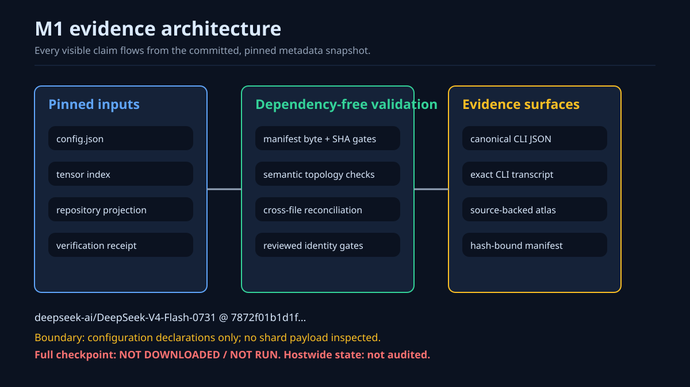
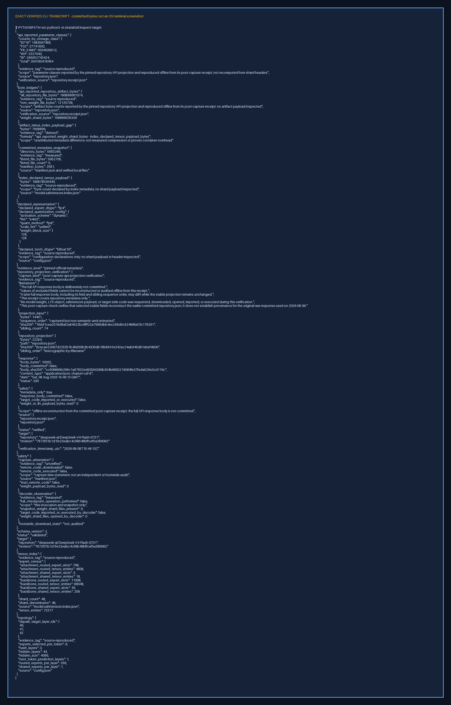
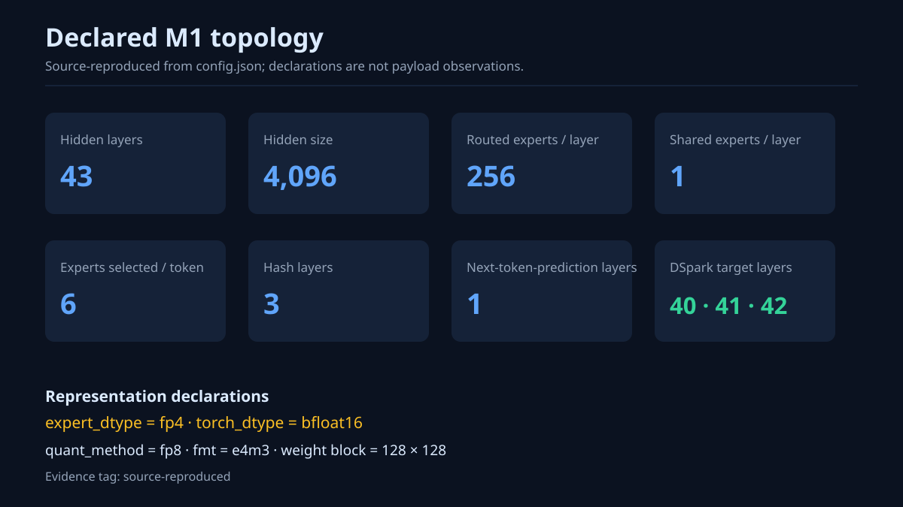
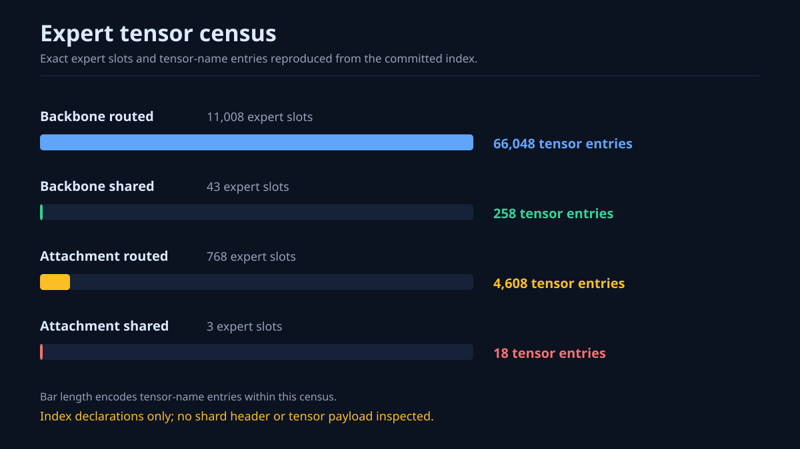
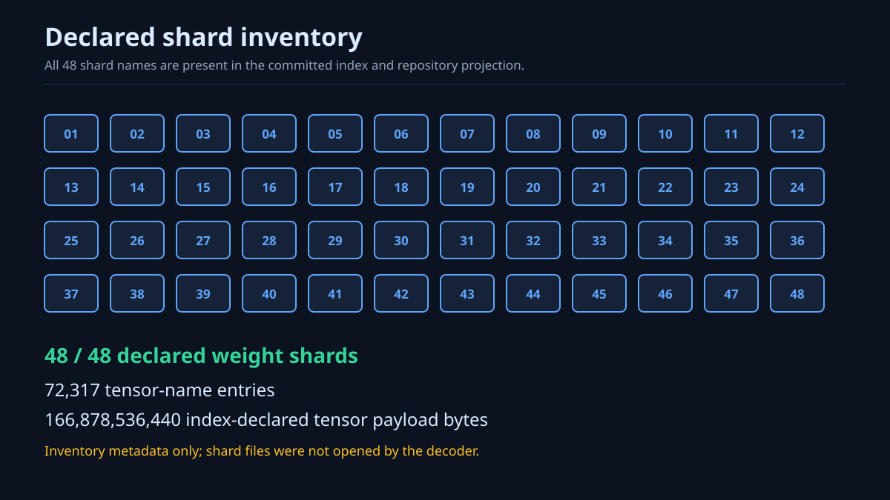
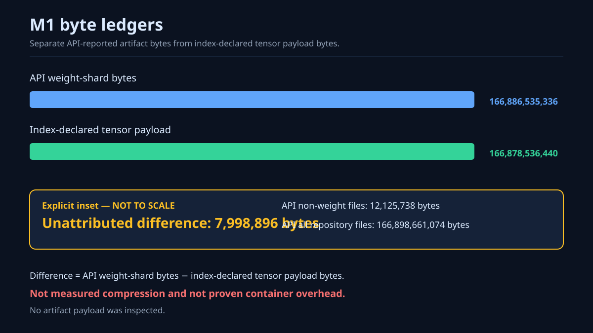
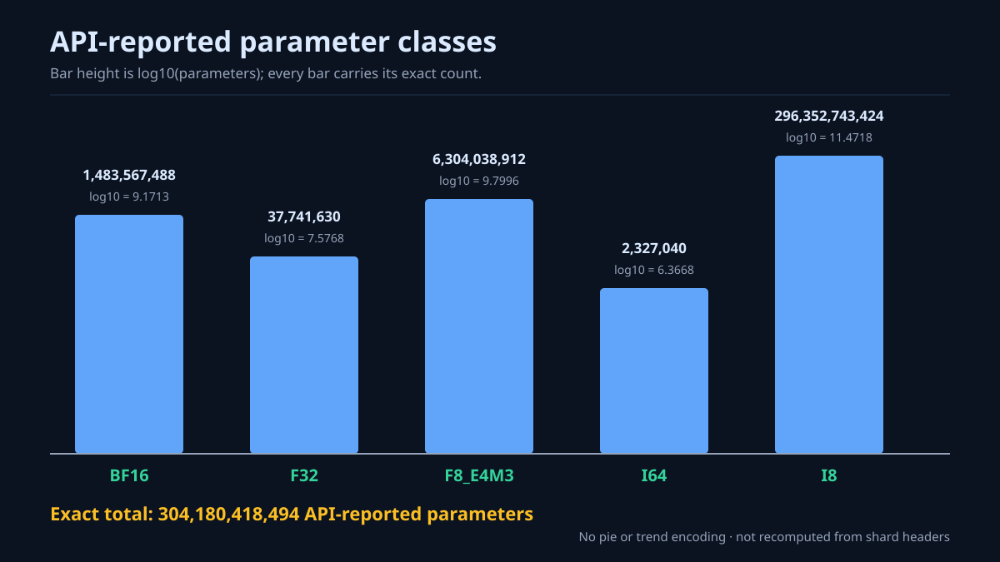
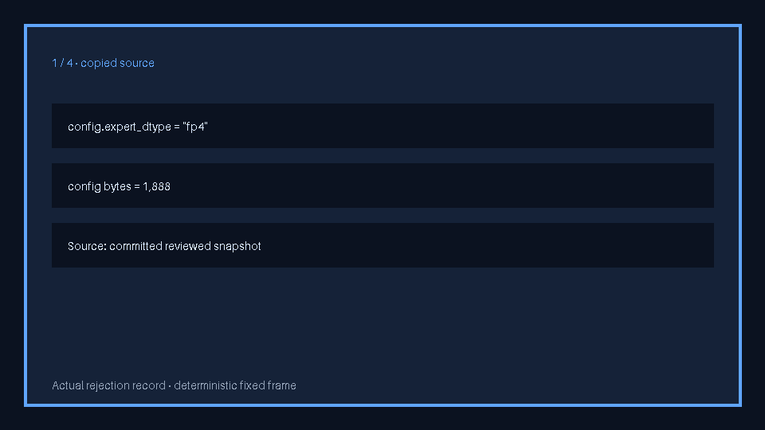
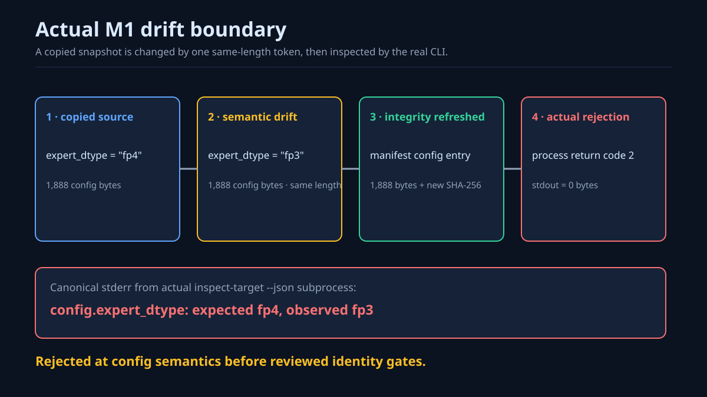

# M1 visual atlas

The M1 visual atlas is an adopted, source-backed view of the validated target-genome evidence. Every adopted byte came from the successful hosted visual job recorded in [the adoption provenance](assets/m1/atlas.provenance.json). The atlas does not add a compression result, inspect a shard payload, or claim that the full checkpoint ran.



*Evidence architecture — [source-reproduced] metadata flows through the dependency-free validator into exact evidence surfaces; [measured] the decoder opened zero shard files and ran no target code.*

## Evidence boundary

The visuals summarize the same committed M1 sources as the machine-readable evidence:

- configuration values are declarations, not shard-header or payload observations;
- API-reported parameter classes are not recomputed from shard headers;
- the 7,998,896-byte difference is [derived] and unattributed, not compression or proven container overhead;
- the capture-time attestation and hostwide download state remain [unverified];
- the full checkpoint is **NOT DOWNLOADED / NOT RUN**.

The PNG below is a rasterization of the exact verified committed CLI transcript. It is explicitly labeled **not an OS-terminal screenshot**.

[](../evidence/raw/m1_target_genome.txt)

*Exact CLI surface — the pixels reproduce the committed transcript; follow the image link to the source text.*

## Source-backed gallery

| Declared topology | Expert census |
| --- | --- |
|  |  |
| [source-reproduced] configuration declarations only | [source-reproduced] tensor-name census from the committed index |

| Shard inventory | Byte ledgers |
| --- | --- |
|  |  |
| [source-reproduced] 48-of-48 filename inventory; no shard opened | [source-reproduced] API/index totals with a [derived], explicitly not-to-scale difference inset |



*Parameter classes — [source-reproduced] from the pinned repository projection and receipt, not recomputed from shard headers. Bar height uses `log10(parameters)`; every bar carries its exact count and is neither a pie nor a trend.*

## Deliberate rejection path



*Controlled rejection — [measured] a temporary copied snapshot changes the same-length token `config.expert_dtype: fp4 → fp3`, refreshes the manifest config entry, and the real `inspect-target --json` subprocess rejects it with return code 2 and empty stdout. This is a deliberate validation experiment, not an upstream incident.*



*Drift boundary — the semantic rejection occurs before reviewed identity gates. The committed [rejection record](../evidence/raw/m1_rejection_path.json) contains the exact canonical stderr and mutation hashes.*

## Adoption and byte identity

The source artifact was CI run `31269327344`, job `93132565296`, artifact `9025118461` (`m1-visual-atlas-31269327344`). Its streamed 440,112-byte archive matched API digest `sha256:42903c22d1d628f2df2f089e0e196b7aacb75a4b66205203c96509f160f73d88`. It contained exactly eleven regular `100644`, `ZIP_STORED` entries. Their exact path mapping, sizes, hashes, review methods, toolchain, and expiry are recorded in [`atlas.provenance.json`](assets/m1/atlas.provenance.json).

The adopted [generator manifest](assets/m1/atlas.manifest.json) is intentionally preserved byte-for-byte. Its `generated-not-adopted` status and false adoption fields describe the artifact-time review gate before this milestone. They were not rewritten after review; the separate adoption provenance is the authoritative record of the later adoption.

The CI source ZIP had one-day retention and is not a durable dependency. The committed files and their provenance hashes are the durable record.

## Reproduce and compare

The Python control plane remains dependency-free. The separate hosted visual job installs only the exact hash-locked Pillow wheel in [`requirements/visuals.txt`](../requirements/visuals.txt), renders into two fresh temporary directories, compares those directories byte-for-byte, and then compares all eleven generated files with the adopted mapping.

To exercise the same targets with the exact visual toolchain in a fresh output directory:

```bash
make M1_VISUAL_DIR="$PWD/artifacts/m1-atlas-replay" visuals-m1
make M1_VISUAL_DIR="$PWD/artifacts/m1-atlas-replay" visuals-m1-verify-adopted
make visuals-m1-test
```

The renderer refuses a stale output directory. No adopted bitmap, animation, SVG, manifest, or rejection record is copied from a third party.
